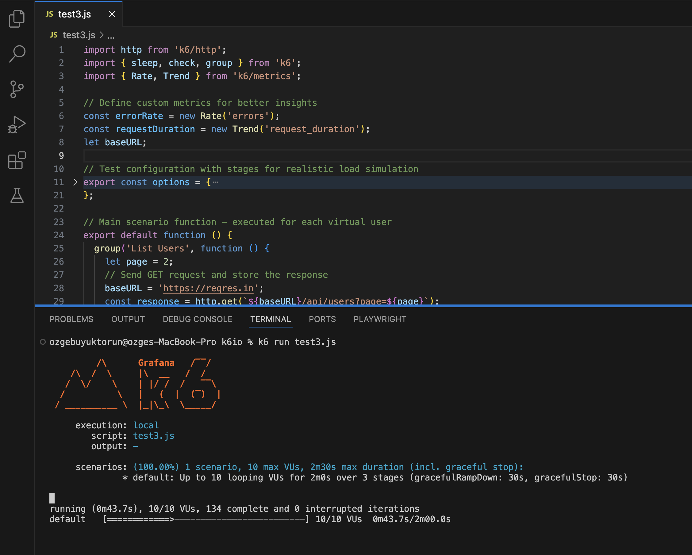
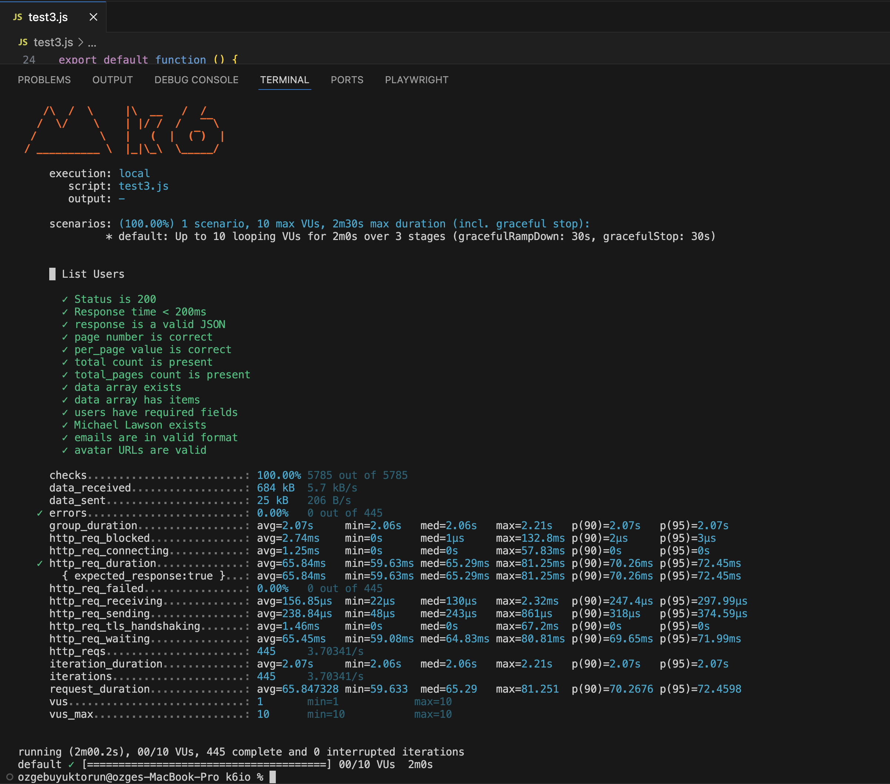
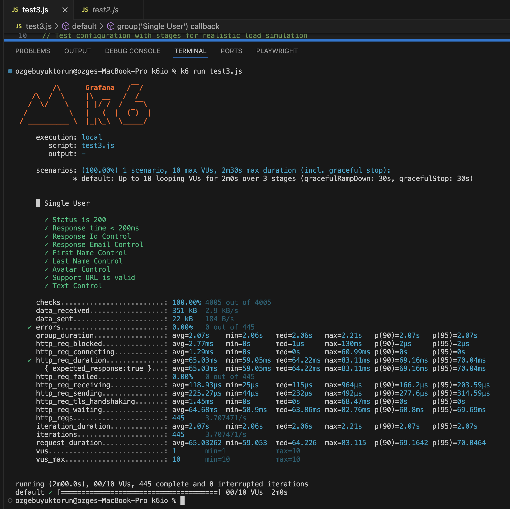
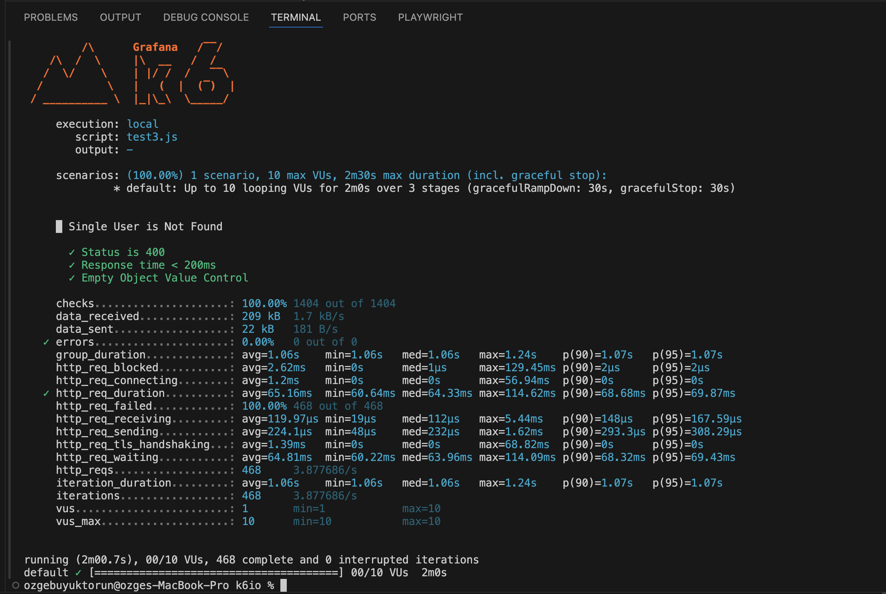

# Reqres.in API Performance Testing Project

## Project Overview

This project provides comprehensive API performance and functional testing for the Reqres.in REST API using Grafana K6 and JavaScript. The test suite is designed to validate various API endpoints with detailed checks and performance monitoring.

## Test Scenarios
The project covers four main test scenarios: Please look first this main test file --> 
```bash
k6 run firstTest.js
```

### 1. User List Retrieval (/api/users)
- Validate API response status
- Check response time
- Verify JSON format
- Validate page-related parameters
- Verify user data structure
- Check specific user details
- Validate email and avatar formats

### 2. Single User Retrieval (/api/users/{id})
- Validate API response for a specific user
- Check user details accuracy
- Verify support information
- Validate response time

### 3. Non-Existent User Scenario (/api/users/{non-existent-id})
- Verify 404 status for non-existent user
- Validate empty response

### 4. Unknown Resource Retrieval (/api/unknown)
- Validate API response status
- Check pagination parameters
- Verify resource data structure
- Validate resource details

## Performance Configuration

Key performance testing features:
- Gradual load increase and decrease
- Virtual User (VU) stages
- Response time thresholds
- Error rate monitoring

### Load Test Stages
- Ramp-up: 30 seconds to 10 virtual users
- Steady state: 1 minute at 10 virtual users
- Ramp-down: 30 seconds to 0 virtual users

### Performance Thresholds
- 95% of requests must complete under 500ms
- Total error rate must be less than 10%

## Prerequisites

- Node.js (v14 or higher)
- Grafana K6
- npm

## Installation

```bash
# Clone the repository
git clone https://github.com/your-username/graphanaK6.git

# Install dependencies
npm install

# Install Grafana K6
# (Follow platform-specific instructions from previous README)
```

## Running Tests

```bash
# Run all tests
k6 run test_file_name/*.js

# Run specific test
k6 run firstTest.js
```

## Custom Metrics

The test script includes custom metrics for:
- Request duration tracking
- Error rate monitoring

## Error Handling

- Retry mechanisms
- Detailed error logging
- Network and API-specific error checks

## Key Validation Checks

- Status code verification
- Response time measurement
- JSON structure validation
- Data integrity checks
- User and resource information validation

### Test Result - Screenshots
- 
- 
- 
- 

## Contributing

1. Fork the repository
2. Create a feature branch
3. Commit your changes
4. Push to the branch
5. Open a Pull Request

## License

[MIT License]

## Resources

- [Grafana K6 Documentation](https://k6.io/docs/)
- [Reqres.in API Documentation](https://reqres.in/)

## Disclaimer

This project is for educational and testing purposes. Always respect the API's terms of service and usage limits.